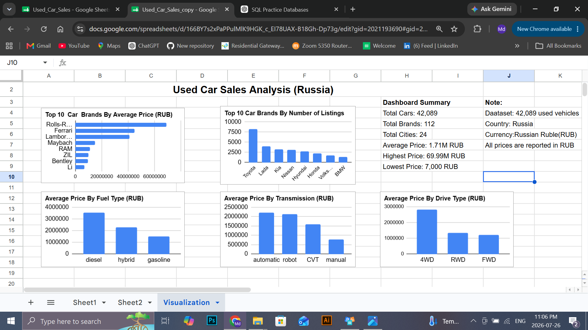

# 🚗 Used Car Sales Analysis Dashboard (Google Sheets)

## 📌 Project Overview

This project analyzes a dataset of **42,089 used car listings** from the Russian used car market using **Google Sheets**. The objective was to clean the data, identify duplicates, perform exploratory data analysis, and build an interactive dashboard that provides business insights into pricing, brands, fuel types, transmissions, and drive types.

---

## 📂 Dataset Information

- **Country:** Russia
- **Currency:** Russian Ruble (RUB)
- **Total Records:** 42,089
- **Total Brands:** 112
- **Total Cities:** 24

---

## 🧹 Data Cleaning

The dataset was cleaned and prepared using Google Sheets.

The cleaning process included:

- Checked for missing values
- Created duplicate keys using ARRAYFORMULA and BYROW
- Verified duplicate counts using COUNTIF
- Confirmed **no exact duplicate records**
- Standardized data for analysis
- Created helper columns for advanced queries

---

## 📊 Analysis Performed

The following analyses were completed using Google Sheets QUERY functions and formulas:

- Brand Analysis
- City Analysis
- Fuel Type Analysis
- Transmission Analysis
- Drive Type Analysis
- Manufacturer Country Analysis
- Average Price by Brand
- Average Price by Fuel Type
- Average Price by Transmission
- Average Price by Drive Type

---

## 📈 Dashboard Summary

The dashboard includes:

- Top 10 Car Brands by Average Price
- Top 10 Car Brands by Number of Listings
- Average Price by Fuel Type
- Average Price by Transmission
- Average Price by Drive Type
- Dashboard Summary (KPIs)

### Key Performance Indicators

- **Total Cars:** 42,089
- **Total Brands:** 112
- **Total Cities:** 24
- **Average Price:** 1.71 Million RUB
- **Highest Price:** 69.99 Million RUB
- **Lowest Price:** 7,000 RUB

---

## 💡 Key Insights

- Toyota has the highest number of used car listings.
- Rolls-Royce has the highest average selling price among all brands.
- Diesel vehicles have the highest average selling price.
- Automatic transmission vehicles command the highest average prices.
- Four-wheel drive (4WD) vehicles have the highest average selling price.
- The dataset contains **no exact duplicate records**, indicating good data quality.
- Vehicle prices are reported in **Russian Rubles (RUB)**.

---

## 🛠 Skills Demonstrated

- Google Sheets
- QUERY Function
- ARRAYFORMULA
- BYROW
- LAMBDA
- COUNTIF
- TEXTJOIN
- Data Cleaning
- Duplicate Detection
- Exploratory Data Analysis (EDA)
- Dashboard Design
- Data Visualization
- Business Analysis

---

## 🖥 Tools Used

- Google Sheets
- GitHub

---

## 📷 Dashboard Preview

> Insert your dashboard screenshot here.

Example:

---

## 👤 Author

**Md Shariful Islam**

Aspiring Data Analyst

Skills: SQL | PostgreSQL | Google Sheets | Power BI | Python (Learning)

GitHub:
(https://github.com/Sharifu-Analysis)

LinkedIn:
(https//linkedin.com/in/islam-Freelancer)

